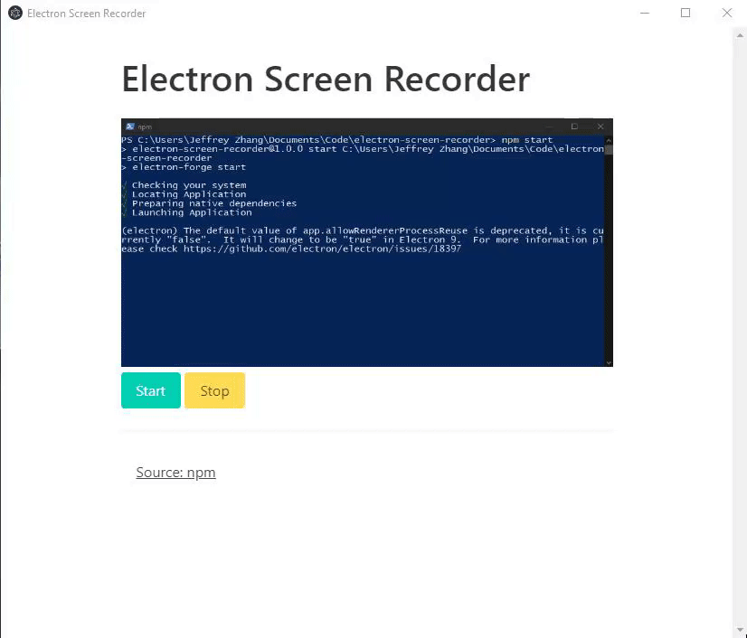
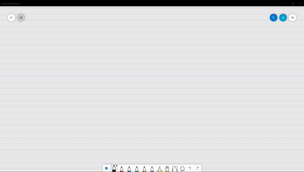

# Electron Screen Recorder
A fully functional desktop screen recorder based on **Electron** and written in **Node.js**.

## About

This program takes advantage of Electron's `desktopCapturer` API and Node's filesystem functionality to natively capture clips from specific windows or entire screens and write them to your drive in `webm` format. 

Since everything is done natively with the single dependency being Electron itself, the result is an extremely lightweight package.

## Usage
To use this program, clone the repository, install its dependencies, and run `npm start` in your shell.
```
# Clone this repository
git clone https://github.com/jeffreyzhang2001/electron-screen-recorder/
# Go into the repository
cd electron-screen-recorder
# Install dependencies
npm install
# Run the app
npm start
```

## Demo
Here is the program in action:



And this is the result! (quality lost during webm -> gif conversion to embed in this README)


